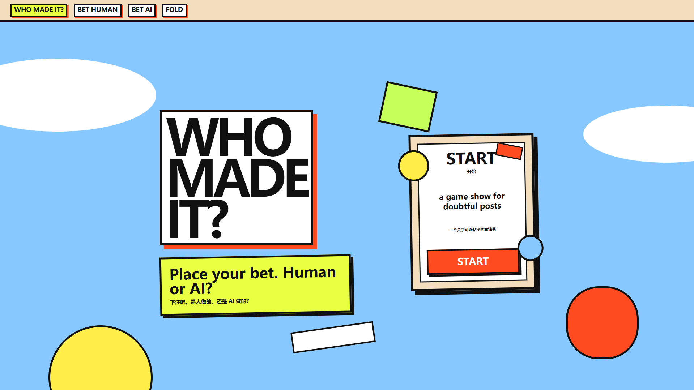

# Who Made It?

Who Made It? is a web-based interactive project for the module Computational Art Practice-Based Research and Theory.

The project looks like a gambling website. The viewer is asked to bet on whether an online post is made by a human or generated by AI. However, this is not a normal guessing game. The work explores how AI labels, platform systems, and public suspicion can change the way people understand authorship, originality, and trust online.

## Project Concept

This project comes from my observation of AI labels on social media platforms. Some human-made posts are marked as possibly AI-generated. At the same time, some AI-made content may not be marked. This creates confusion around what counts as human-made work.

In the website, viewers receive Trust Chips. These chips are not money. They represent the trust that people spend when they judge others online. Each bet becomes part of the system.

The project asks:

Who has the power to decide whether something is human-made or AI-made?

## Website Structure

The website has three main parts:

1. Casino Entrance
   The viewer enters a gambling-style interface.

2. Betting Rounds  
   The viewer bets on different online posts. The five groups are:
   - Game images
   - Real bodies
   - Original art
   - Pet videos
   - Text posts about AI labels

3. Trust Redemption Center
   The viewer receives a random reward. The result may not match their performance. This shows how platform feedback can feel fair, but still work as data collection.

## Main Idea

The project shows a cycle:

Humans suspect each other.  
Platforms collect suspicion.  
AI learns suspicion.  
Human originality is judged back by AI.

## Tools

This project was made as a web-based experience using HTML, CSS, and JavaScript.

## Author

Man Hei Jiang
